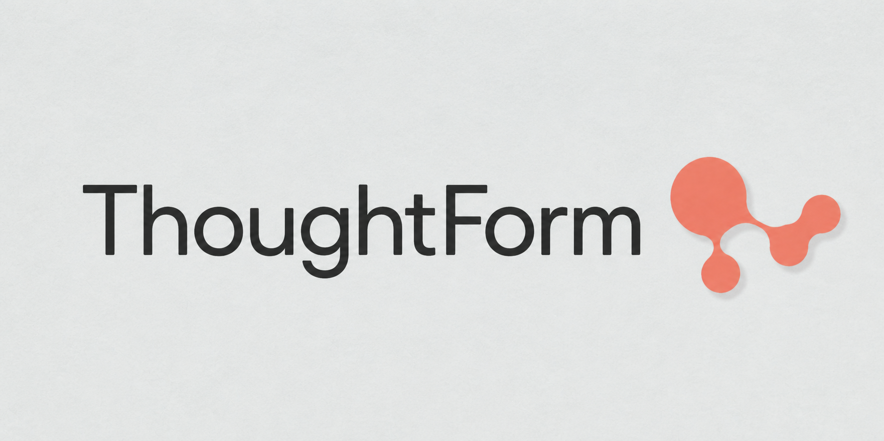
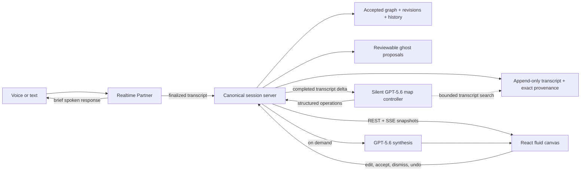

<p align="center">
  
</p>

<p align="center">
  <strong>Think out loud. Watch your ideas take shape.</strong><br />
  A voice-first thinking environment where a conversation becomes a living, explorable map.
</p>

<p align="center">
  Built for <a href="https://openai.devpost.com/">OpenAI Build Week</a> · Apps for your life
</p>

## Team

I built ThoughtForm with my friend and co-contributor/co-submitter, **Hemanth Sammatur**. We worked closely on the architecture and design throughout the project, and used Codex with **GPT-5.6 Sol** as our coding agent for both the frontend and backend.

## The idea

Most thinking tools make you choose: stay in the flow, or stop and organize what you are thinking. Voice AI has the opposite problem. The conversation can feel natural, but every idea is still trapped in a linear transcript.

ThoughtForm is meant to feel more like a visible second working memory. You speak naturally with an AI partner while a map forms alongside the conversation. Completed thoughts become concise bubbles, related ideas connect, repeated ideas grow warmer instead of duplicating themselves, and every interpretation remains traceable to the exact words that produced it.

The larger idea is a reciprocal loop:

> You think aloud → ThoughtForm captures what you mean → the map reveals structure → ThoughtForm proposes new possibilities → something catches your attention → that changes what you think about next.

It is not a recorder that generates a diagram after the fact. The map is part of the thinking process while it is happening.

## What the hackathon build does

- Holds a low-latency voice conversation with a warm, brief AI `Partner`.
- Commits only finalized utterances. Partial speech stays in the live caption and never rewrites the map.
- Condenses one completed thought into at most three legible bubbles while preserving the full transcript.
- Uses a silent GPT-5.6 controller to create, revisit, edit, connect, and reorganize ideas without delaying the spoken response.
- Commits clear, reversible interpretations directly and turns uncertain or destructive interpretations into ghost proposals with explicit accept and dismiss controls.
- Links bubbles back to exact transcript spans so the map remains correctable rather than becoming an untraceable AI summary.
- Keeps one underlying graph with switchable organic cluster and hierarchy views.
- Supports direct manipulation: drag, connect, edit, delete, rectangle-select, focus, zoom, undo, and redo.
- Produces a written synthesis of the current map without turning the result into an action plan.
- Persists the canonical session as local JSON, including transcript, graph, proposals, revisions, and activity history.

The primary conversation-first experience lives at `/`. The earlier Paper/Nocturne canvas remains available at `/?mode=classic` as a design and interaction sandbox, including direct AI branch generation.

## The two AI streams

ThoughtForm is designed around two related but different kinds of intelligence:

1. **Your thought stream** becomes concise, provenance-linked bubbles. The system organizes what you meant without pretending its interpretation is the original source.
2. **ThoughtForm's idea stream** introduces possibilities that were not already in your words: an analogy, counterexample, question, tension, connection, or new branch.

The current primary session focuses on making the first stream trustworthy and gives uncertain structural work a complete ghost-proposal lifecycle. Classic mode already demonstrates generated ghost branches. The next product step is to bring a dedicated generative ideator into the primary session so those new possibilities can appear quietly while the conversation continues.

## How it works



The server owns semantic truth. It stores the complete transcript, accepted graph, proposal state, operation record, and revision history. The browser owns transient physics, deformation, and animation. That separation lets the canvas feel fluid without allowing an old React render or a stale model response to overwrite newer meaning.

The controller uses strict structured output and exact evidence. It can search older transcript context when necessary, but it cannot treat transcript text as instructions or cite speech that occurred after the transcript watermark it was given. Revision checks, idempotent call IDs, proposal rebasing, and atomic undo protect the map when voice, UI, and background model work arrive concurrently.

## OpenAI technology

### In the product

- **GPT Realtime (`gpt-realtime-2.1`)** powers the foreground voice conversation over WebRTC. It responds to the substance of the conversation and uses map tools only for explicit spoken map commands.
- **GPT-5.6 Sol** runs as a silent, asynchronous map controller over the Responses API. It receives completed transcript deltas and returns schema-constrained map operations or a reviewable proposal.
- **GPT-5.6 Terra** powers on-demand synthesis and the classic canvas AI flows by default. Models remain configurable through environment variables.
- **Structured Outputs and function calling** constrain graph mutations, evidence, and proposal operations instead of asking the UI to interpret free-form model prose.

### In the development process

Hemanth and I used Codex with GPT-5.6 Sol throughout the project as our implementation, debugging, and review partner across both the frontend and backend. The useful part was not code generation by itself. It was being able to turn a fairly opinionated interaction contract into working behavior, inspect it in the browser, find where the boundaries failed, and keep iterating across product design, geometry, state, Realtime events, and server behavior.

Codex accelerated our work on:

- Turning the initial product conversation and visual references into interactive Paper and Nocturne prototypes.
- Building the organic lobe renderer, fused connections, local physics, causal growth and rupture motion, and the canvas gesture system.
- Moving the session model from browser-only prototype state into a server-owned, revisioned local session.
- Implementing the Realtime WebRTC bridge, the GPT-5.6 controller, structured operations, SSE updates, provenance validation, proposal rebasing, and automated tests.
- Running repeated browser QA and adversarial review passes that caught stale snapshots, conflicting revisions, gesture collisions, and cross-boundary Realtime races.

We kept the key product and design decisions explicit: conversation stays in the foreground; the graph changes only after a complete thought; the transcript is lossless; clear changes can be direct but meaning-changing uncertainty must stay reviewable; accepted nodes are never silently rewritten; semantic state belongs to the server while physical motion belongs to the browser; and the final artifact is a thinking map plus synthesis, not a generated task list.

## Design principles

- **Do not interrupt thought to document thought.** Mapping should happen quietly around the conversation.
- **Interpretation is not source.** Bubbles can be concise, but the complete transcript and exact provenance remain available.
- **Agency scales with uncertainty.** Clear reversible intent can commit; uncertain or destructive interpretation becomes a proposal.
- **Motion should explain cause.** Connections grow from a source, contact a target, and rupture from the exact click point. Nothing moves merely to look alive.
- **One graph, multiple views.** Clusters and hierarchy are different ways to inspect the same ideas, not separate documents.
- **Local-first by default.** The hackathon prototype stores session artifacts locally and does not retain raw audio.

## Run locally

### Requirements

- Node.js 20 or newer
- npm
- An OpenAI API key for live voice and model-backed mapping
- A modern browser with WebRTC and microphone support

### Setup

```bash
git clone https://github.com/maxrubin629/thoughtform.git
cd thoughtform
npm ci
cp .env.example .env
```

Add your key to `.env`:

```dotenv
OPENAI_API_KEY=sk-...
OPENAI_MODEL=gpt-5.6-terra
OPENAI_REALTIME_MODEL=gpt-realtime-2.1
OPENAI_REALTIME_VOICE=marin
OPENAI_MAP_CONTROLLER_MODEL=gpt-5.6-sol
THOUGHTFORM_MAP_CONTROLLER_ENABLED=true
PORT=8787
```

Start the API and Vite app together:

```bash
npm run dev
```

Open [http://127.0.0.1:5173](http://127.0.0.1:5173), allow microphone access, and start with any unresolved idea.

The server also starts without an API key in mock mode, which is useful for exploring the canvas and typed-thought flow. Live voice, synthesis, and the GPT-5.6 controller require a valid key. Local sessions are written to `data/sessions/` and are intentionally ignored by Git.

### Useful commands

```bash
npm run dev          # API + frontend development servers
npm run dev:client   # frontend only
npm run build        # production build
npm run preview      # preview the production build
npm test             # automated unit and integration tests
```

The current hackathon branch builds successfully and passes all 145 automated tests.

## Built with

- React 19 and Vite 6
- Express 5
- OpenAI JavaScript SDK
- OpenAI Responses API
- OpenAI Realtime API over WebRTC
- Server-Sent Events
- Canvas 2D and WebGL2
- Tabler Icons and Manrope
- Local JSON persistence with atomic writes

## Challenges we ran into

### Keeping conversation and mapping independent

The fastest voice response and the best map update do not have the same timing. Making one model responsible for both creates awkward speech, tool preambles, and pressure to update the map from partial thoughts. The solution was to split the foreground Realtime partner from the silent GPT-5.6 controller and let them meet at the canonical transcript.

### Preserving one source of truth without making the canvas feel rigid

The map needs revision checks and durable history, but the bubbles also need to stretch, wobble, collide, and follow the pointer without round-tripping every frame through a server. Separating semantic state from transient physical state was the key architectural decision.

### Making autonomy feel safe instead of timid

If every model action needs confirmation, the user becomes the system's project manager. If the model freely rewrites accepted ideas, the map stops feeling like the user's thinking. Confidence-gated autonomy created a better boundary: direct and reversible when intent is clear, visible and reviewable when interpretation matters.

### Building an organic interface with exact interactions

The connected lobes are not cards with lines between them. They are one continuous material whose geometry has to remain draggable, selectable, editable, collision-aware, and causally animated. A lot of the work was not drawing the shape once; it was preserving that visual language across every interaction and state transition.

## Accomplishments we're proud of

- A real conversation-first session rather than a scripted voice mockup.
- A server-owned semantic graph with append-only transcript, exact source spans, revisions, proposals, activity history, and reversible map edits.
- A silent controller that can work after each completed utterance without slowing or narrating the conversation.
- Reviewable ghost operations that can rebase against a newer map and drop invalid or duplicate changes safely.
- A visual system where the interaction model and the product idea are the same thing: ideas feel distinct, connected, movable, and alive without becoming visually noisy.

## What we learned

The important boundary is not simply which model is more capable. It is which model is allowed to act, on what evidence, and at what moment.

Realtime is best when it protects the conversational flow. GPT-5.6 is best when it can reason over a larger semantic state without needing to speak. The canonical session is what makes those two forms of intelligence feel like one product rather than two competing agents.

We also learned that provenance changes the experience more than we expected. Once a bubble can reveal the exact moment it came from, aggressive condensation becomes much safer because the user's original meaning is never gone.

## What's next

- Bring a dedicated generative ideator into the primary session so new analogies, questions, tensions, and branches can appear as quiet ghost possibilities while the user keeps speaking.
- Package the experience as the intended local-first Electron app.
- Add multi-speaker sessions and diarization after the solo thinking loop is stable.
- Add end-of-session consolidation and richer synthesis without turning ThoughtForm into an action-plan generator.
- Validate the real success criterion: whether people discover useful structure or a direction they would not have reached without seeing the map evolve.

## Build Week scope

ThoughtForm's repository, interaction system, canonical session architecture, OpenAI integrations, and primary conversation-first experience were created during the OpenAI Build Week submission period by Max Rubin and Hemanth Sammatur, working with Codex and GPT-5.6 Sol.
